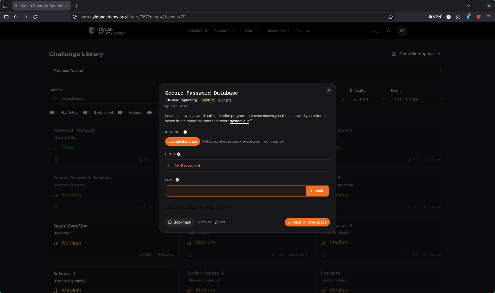
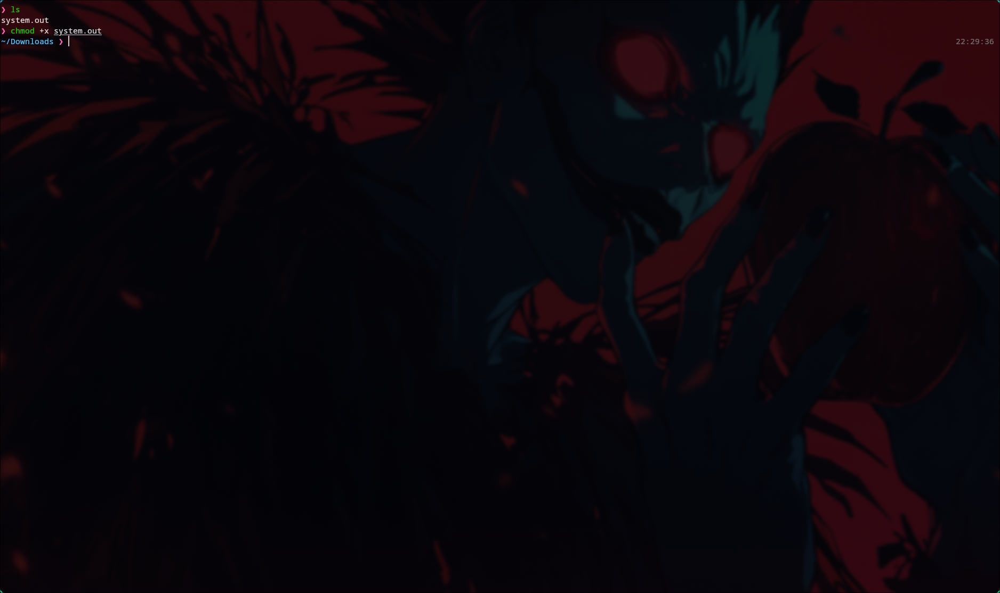
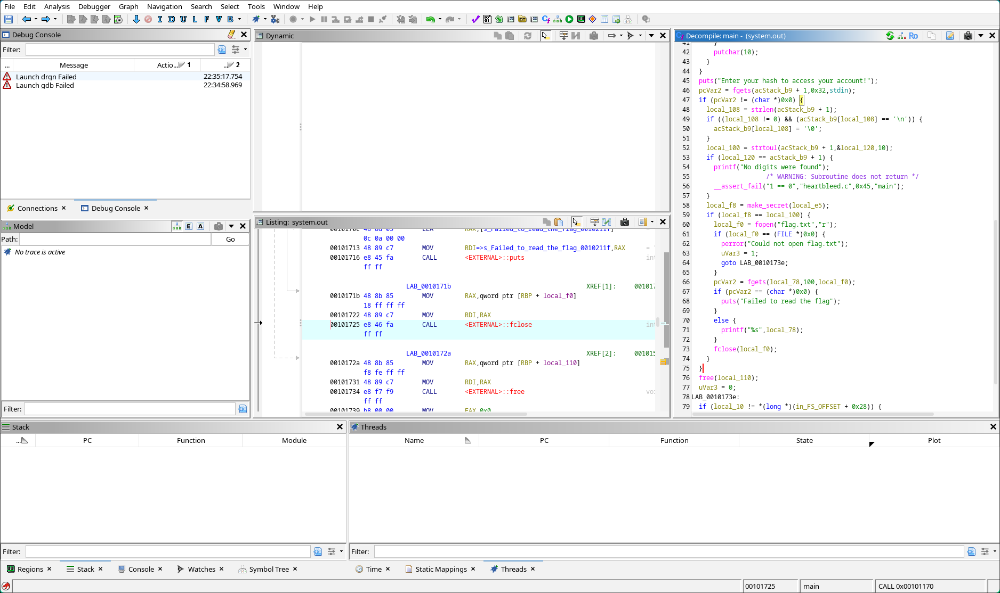
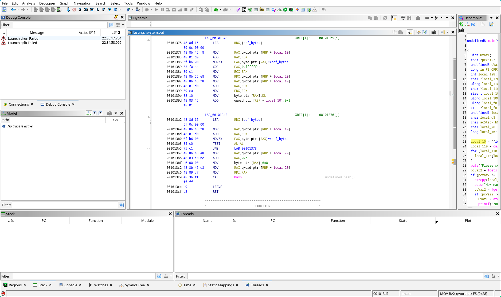
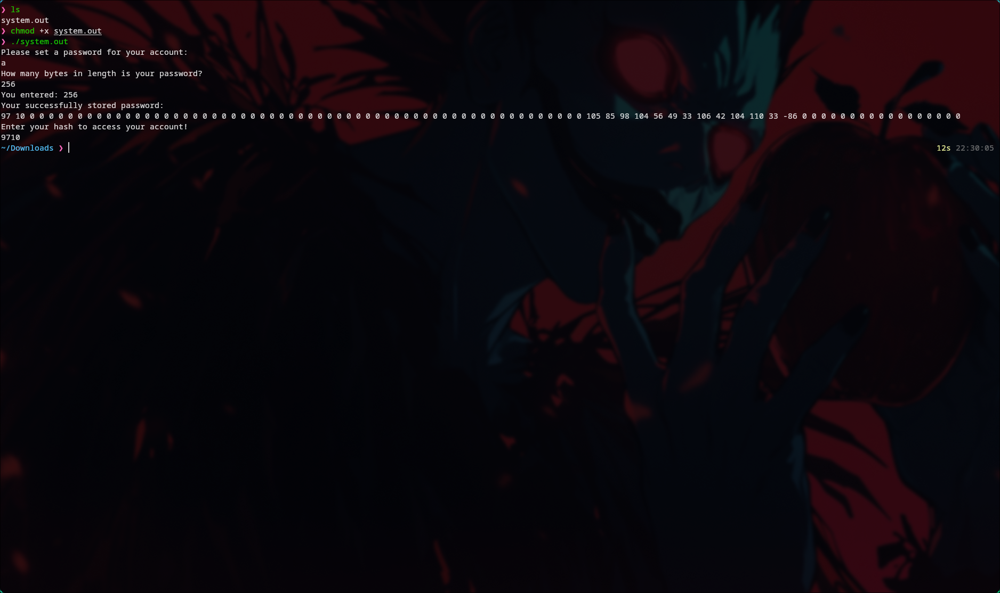
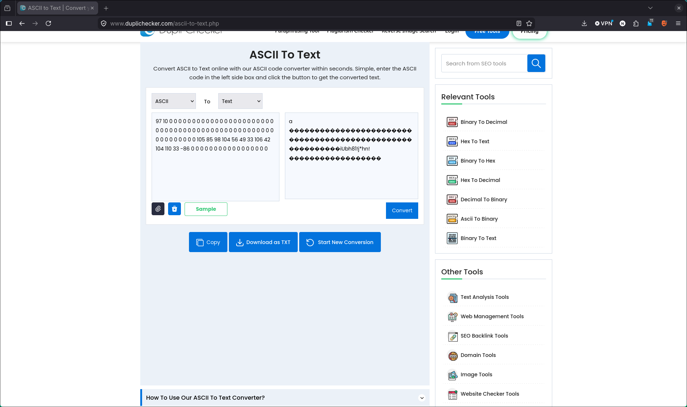
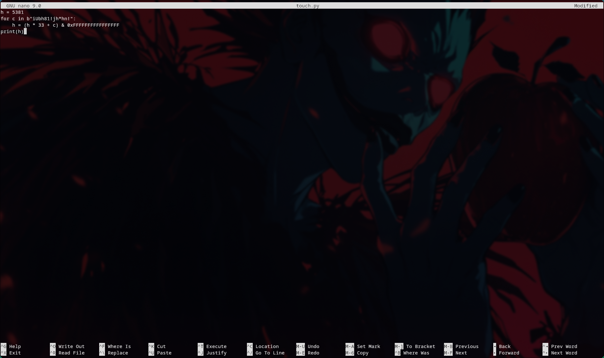
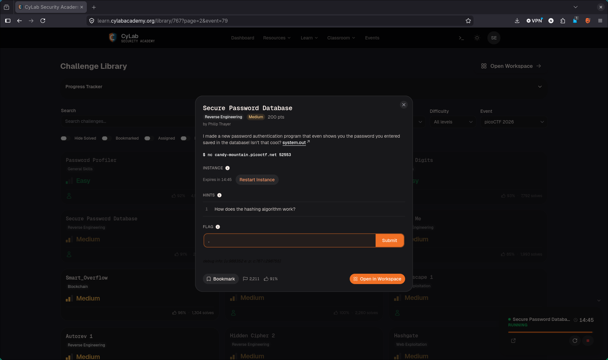
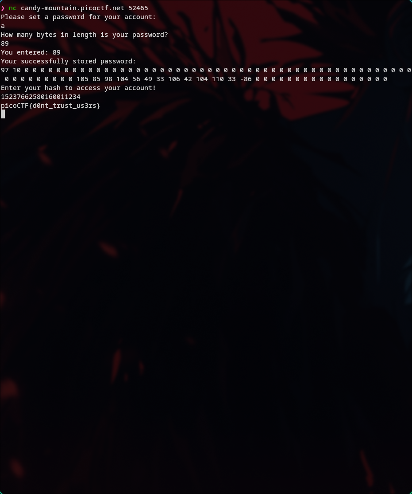

# 🔥 Challenge: Secure Password Database

**Category:**   Reverse Engineering  
**Difficulty:**   Medium  
**Points:**   200

---

## 🧩 Description

The challenge provides a binary `system.out` and netcat access to a remote instance.

> "I made a new password authentication program that even shows you the password you entered saved in the database! Isn't that cool? `system.out`"



---

## 🧠 Approach

The flavor text is the hint: a program that "shows you the password you entered" is inviting an overread. The program stores a hidden secret in the same buffer as the user's password — XOR-decoded bytes baked into the binary and placed at offset 60 of a 90-byte allocation. The echo loop uses an attacker-supplied length instead of the actual password length, so we can read far past our own input.

By claiming our password is 89 bytes long, we leak the decoded secret sitting at the far end of the buffer. The program then expects a hash at login — specifically djb2 of that same secret — so once we have the bytes we can compute the value and pass the check.

---

## ⚔️ Exploitation

1. Make the binary executable

```bash
chmod +x system.out
```



2. Load in Ghidra and decompile `main`

The buffer is 90 bytes (`calloc(0x5a, 1)`). User input lands at offset 0. At offset 60, the program XOR-decodes a 13-byte constant (`obf_bytes[i] ^ 0xaa`) into the same buffer. The echo loop is bounded by `uVar1` — the user-supplied length — not `strlen` of the actual password.



3. Inspect the hash functions

`make_secret` performs the same XOR decode and passes the result to `hash()`, which is the standard djb2 algorithm. The value the program expects at the hash prompt is `djb2(decoded_secret)`.



4. Run locally and trigger the overread

```bash
./system.out
```

Enter password: `a`, then claim the length is `89`. The program prints all 90 bytes as space-separated decimals. The decoded secret appears starting at offset 60.



5. Convert the leaked bytes to ASCII

The bytes at offsets 60–71 are `105 85 98 104 56 49 33 106 42 104 110 33`. Converting to ASCII gives the secret: **`iUbh81!j*hn!`**



6. Compute the djb2 hash

```python
h = 5381
for c in b"iUbh81!j*hn!":
    h = (h * 33 + c) & 0xFFFFFFFFFFFFFFFF
print(h)
```

Result: `15237662580160011234`



7. Launch the instance and connect



```bash
nc candy-mountain.picoctf.net <port>
```

Repeat the overread to confirm the same bytes, then submit the hash at the prompt.



---

## 🚩 Flag

This gives us the flag: picoCTF{d0nt_trust_us3rs}
