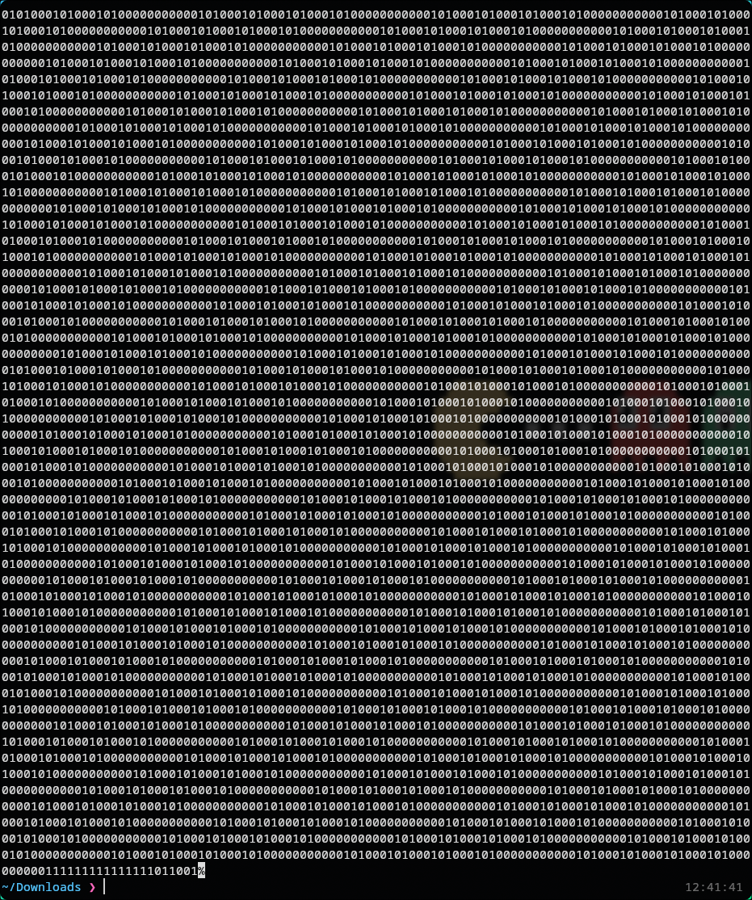
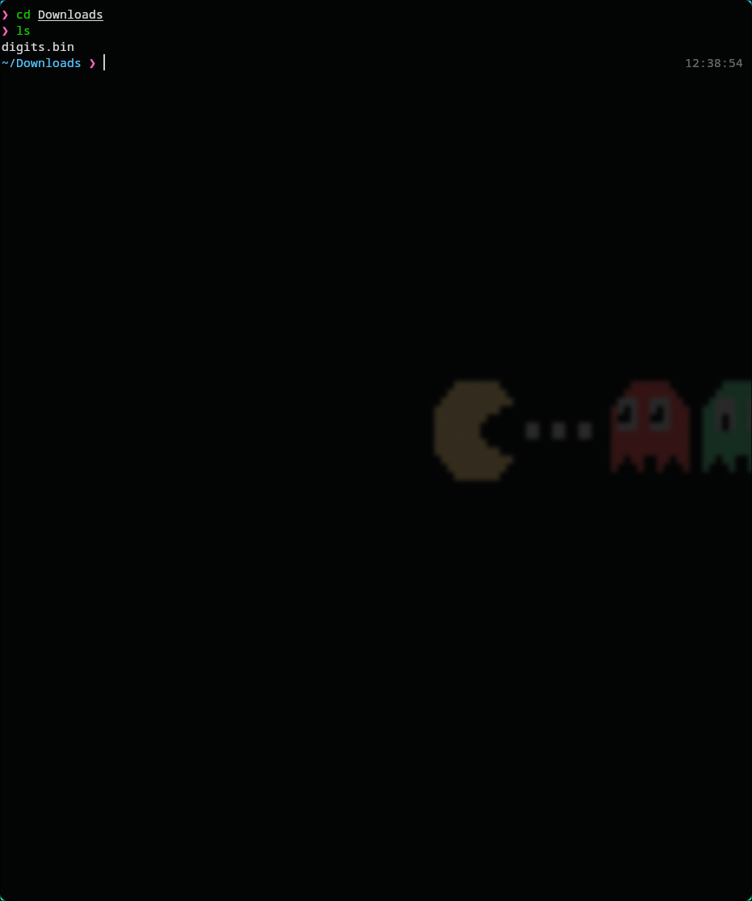
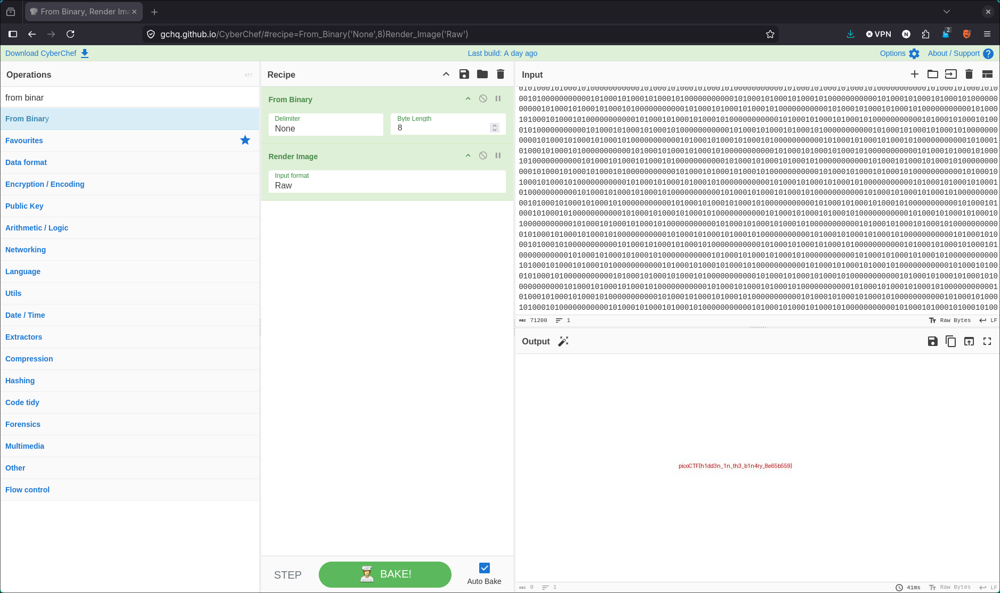

# 🔥 Challenge: Binary Digits

**Category:** Forensics
**Difficulty:**  Easy
**Points:** 100

---

## 🧩 Description

We are provided with a .bin file that contains only ones and zeros.



---

## 🧠 Approach

For this challenge I'm going to take the binary output and put it into cyberchef to see if there is any information it can give us.

---

## ⚔️ Exploitation

1. Look at the provided files
```bash
cd Downloads
ls
```


2. Copy the contents to clipboard
```bash
wl-copy < digits.bin
```

3. Paste into cyber chef
Use the Recipe:
- From Binary
- Render Image



---
## 🚩 Flag

This gives us the flag: picoCTF{h1dd3n_1n_th3_b1n4ry_8e65b669}
