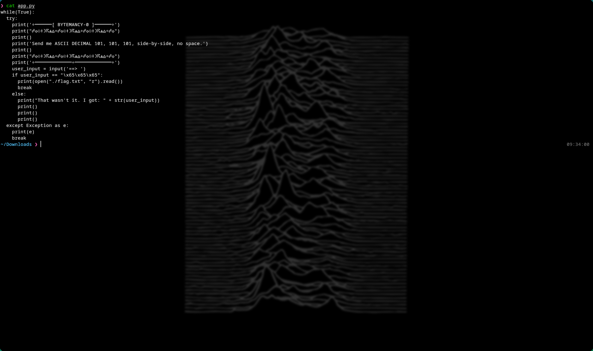
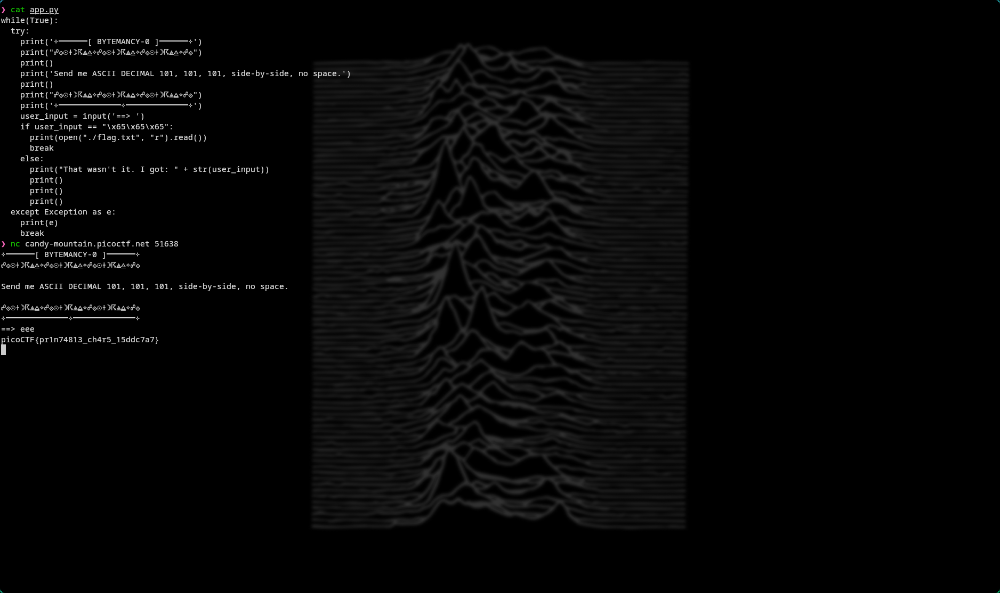

# 🔥 Challenge: Bytemancy-0

**Category:** General Skills  
**Difficulty:** Easy  
**Points:** 50

---

## 🧩 Description

The challenge prompts:

> "Send me ASCII DECIMAL 101, 101, 101, side-by-side, no space."

We are also given access to the program’s source code.


---

## 🧠 Approach

Inspecting the provided Python source code reveals the validation condition:

```python
if user_input == "\x65\x65\x65":
```

Breaking this down:

\x65 is a hexadecimal escape sequence

Hex 0x65 = 101 in decimal

ASCII decimal 101 corresponds to the character 'e'

Since this sequence appears three times:

The program expects the string "eee"

---

## ⚔️ Exploitation

1. Inspect the file

```bash
cat app.py
```



2. Connect to the challenge instance

```bash
nc candy-mountain.picoctf.net 51638
```

3. Input the correct string

```bash
eee
```



---

## 🚩 Flag

This gives us the flag: picoCTF{pr1n74813_ch4r5_15ddc7a7}
