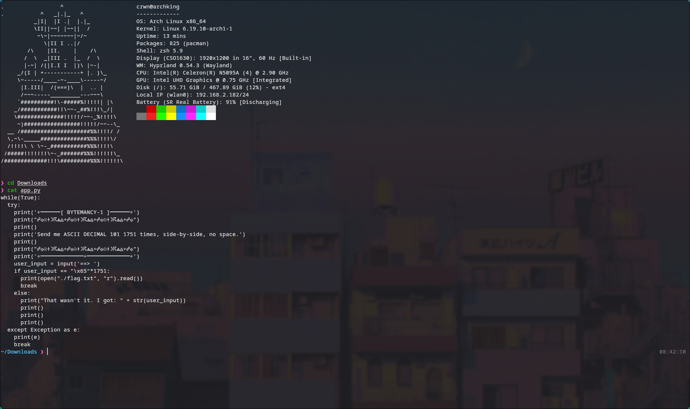
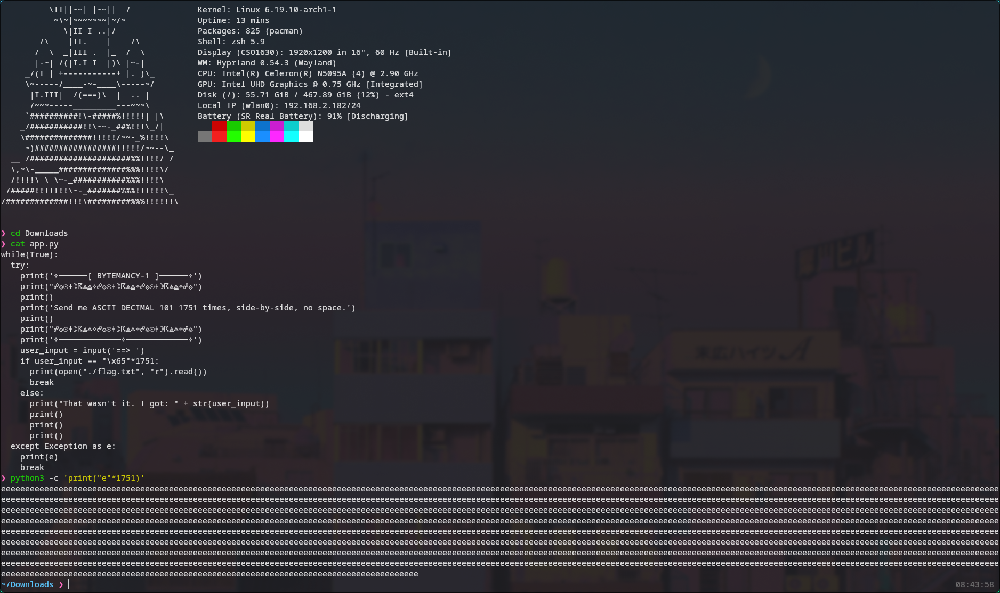
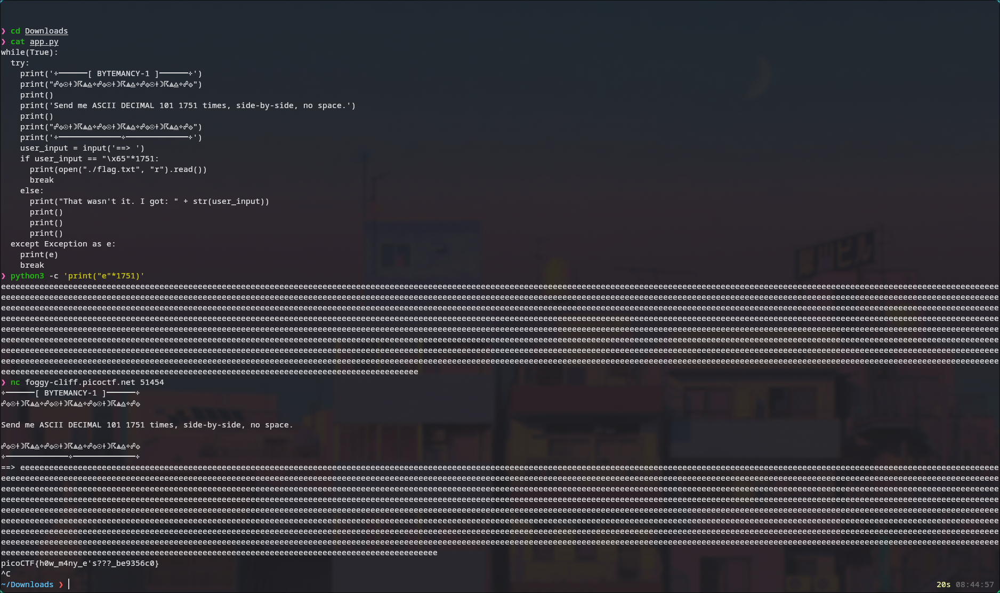

# 🔥 Challenge: Bytemancy-1

**Category:** General Skills  
**Difficulty:** Easy  
**Points:** 50

---

## 🧩 Description

The challenge prompts:

Can you conjure the right bytes?

The program's source code can be downloaded here.

Connect to the program with netcat: $ nc foggy-cliff.picoctf.net 51454


---

## 🧠 Approach

Inspecting the provided Python source code reveals the validation condition:

```python
if user_input == "\x65"*1751:
```

Breaking this down:

\x65 is a hexadecimal escape sequence
Hex 0x65 = 101 in decimal

ASCII decimal 101 corresponds to the character 'e'

This means the program is actually expecting:

the character 'e' repeated 1751 times

---

## ⚔️ Exploitation

1. Inspect the source code

```bash
cat app.py
```



2. Generate the required input

```bash
python3 -c 'print("e"*1751)'
```


3. Connect to the challenge instance and paste

```bash
nc foggy-cliff.picoctf.net 51454
```



---

## 🚩 Flag

This gives us the flag: picoCTF{h0w_m4ny_e_s???_be9356c0}
