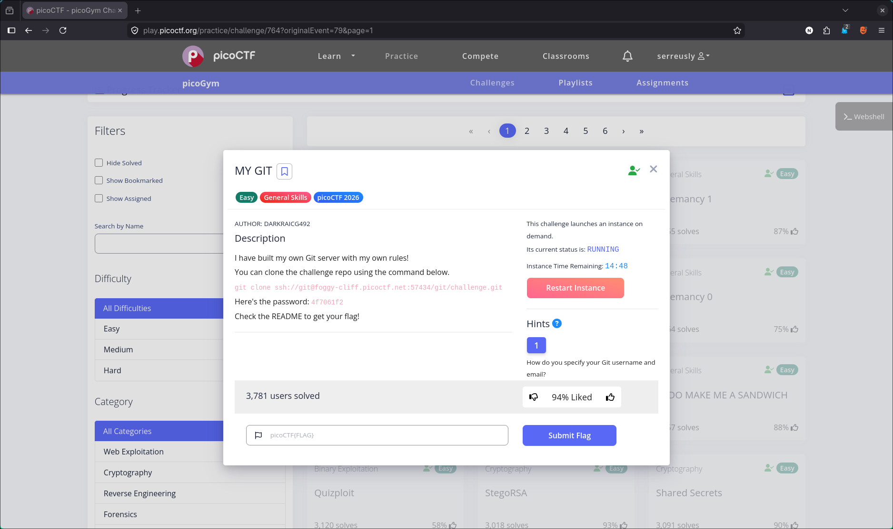
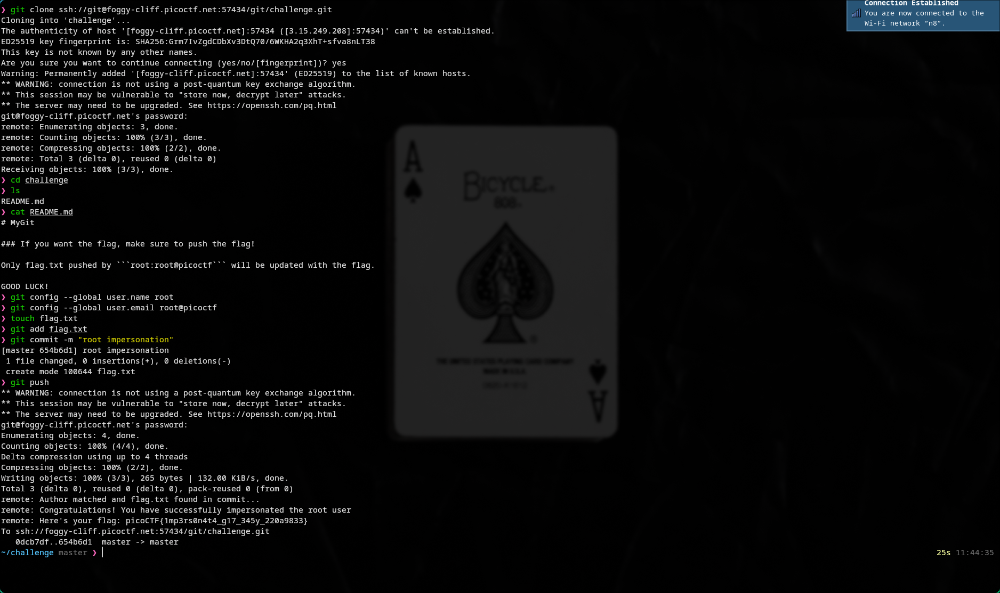

# 🔥 Challenge: My Git

**Category:** General Skills  
**Difficulty:** Easy  
**Points:** 50

---

## 🧩 Description

The challenge involved interacting with a Git repository and following instructions found within it to retrieve the flag.



---

## 🧠 Approach

Upon accessing the challenge environment, the first step was to explore the contents of the repository.

Listing files revealed a `challenge` directory, which contained a `README.md`. This file provided guidance on how to proceed.

This indicated that the challenge was not about exploitation, but rather understanding how Git operations can be used to manipulate and retrieve data.

---

## ⚔️ Exploitation

1. Navigate the repository:
```bash
ls
cd challenge
ls
```
3. Read the instructions:
```bash
cat README.MD
```
5. Follow the instructions from the README.MD
```bash
git config --global user.name root
git config --global user.email root@picoctf
touch flag.txt
git add flag.txt
git commit -m "root impersonation"
```
7. Submit password from git output:
picoCTF{1mp3rs0n4t4_g17_345y_220a9833}

## 📖 Documentation


