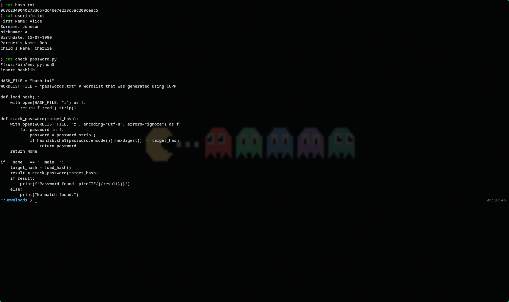
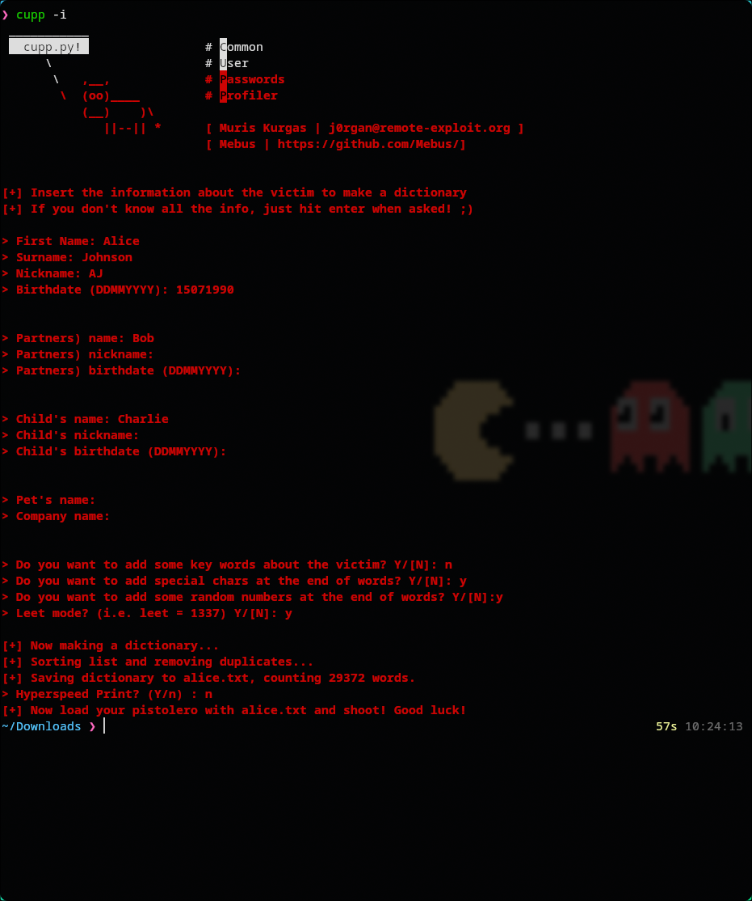

# 🔥 Challenge: Password Profiler

**Category:** General Skills
**Difficulty:** Easy
**Points:** 100

---

## 🧩 Description

This challenge provides a file containing the SHA-1 hash of the password, personal information about the target user, and a python script for checking the hashes of a wordlist against the actual hash to crack the password.




---

## 🧠 Approach

The challenge provides us a hint about CUPP. CUPP is a tool that takes user information and generates a wordlist. For this challenge we are going to take the user information provided to generate a wordlist of possible passwords and run that wordlist against the password checker for a match, and that will give us the flag.

---

## ⚔️ Exploitation

1. Take a look at the files provided
``` bash
cd Downloads
ls
```


2. Generate a wordlist using cupp


3. Rename alice.txt to passwords.txt and run against check_password.py
```bash
mv alice.txt passwords.txt
python3 check_password.py
```


---
## 🚩 Flag

This gives us the flag: picoCTF{Aj_15901990}
