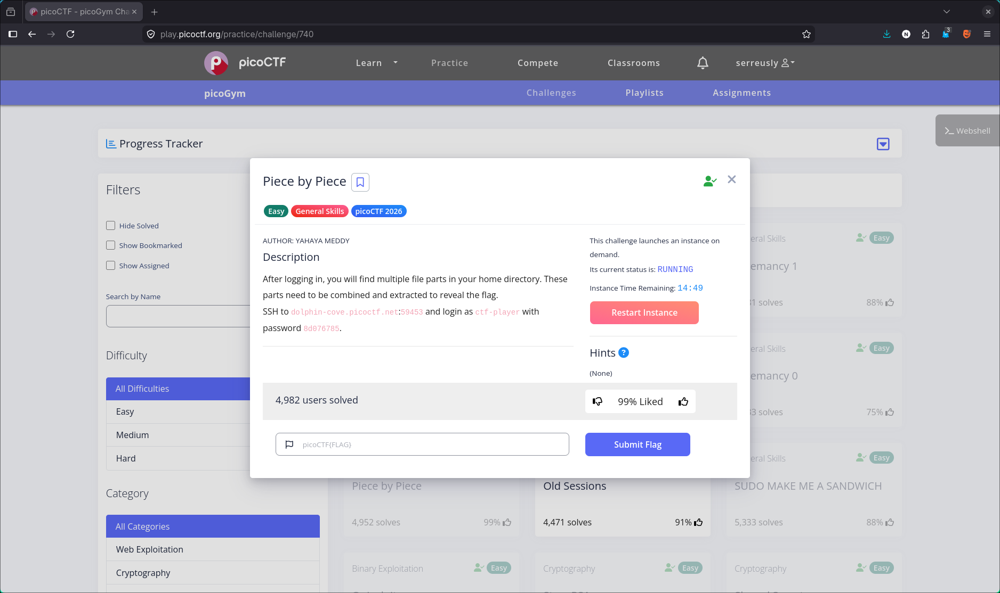
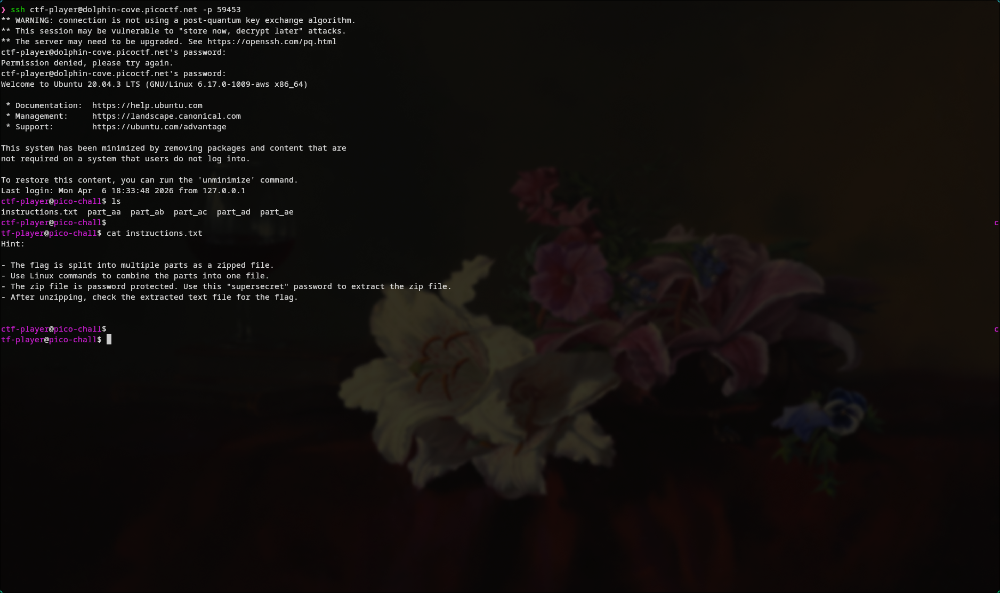
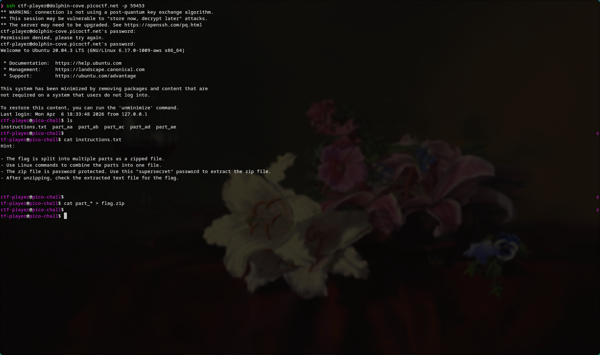
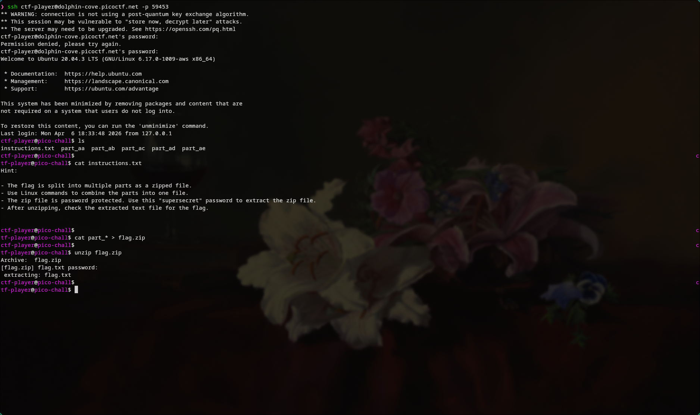
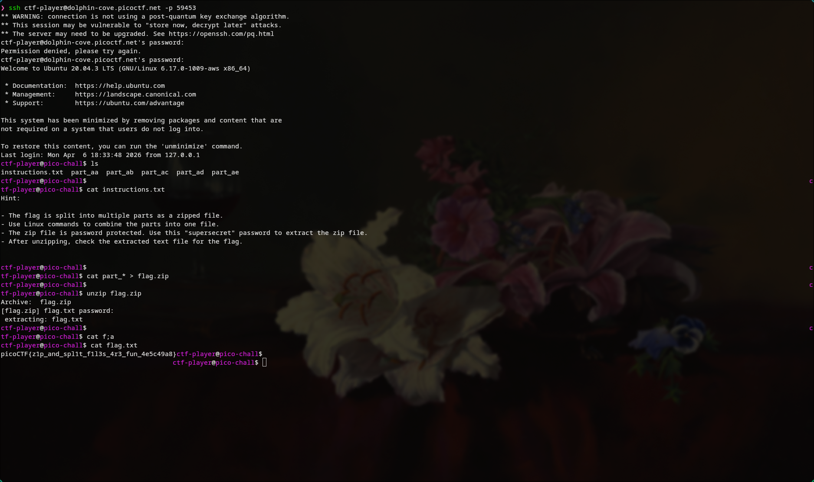

# 🔥 Challenge: Piece by Piece

**Category:** General Skills  
**Difficulty:** Easy  
**Points:** 50

---

## 🧩 Description

After logging in, multiple file parts are found in the home directory. These parts must be combined and extracted to reveal the flag.



---

## 🧠 Approach

After connecting via SSH, listing the directory reveals several file fragments:

part_aa part_ab part_ac part_ad part_ae



The `instructions.txt` file provides the key steps:

- The flag is stored inside a **zip archive**
- The archive has been split into multiple parts
- The parts must be combined into a single file
- The zip is password protected (`supersecret`)

This indicates we need to reconstruct the archive using standard Linux tools.

---

## ⚔️ Exploitation

1. Combine all file parts into a single zip archive:

```bash
cat part_* > flag.zip
```


2. Extract the archive:

```bash
unzip flag.zip
```



3. Read the extracted flag.txt

```bash
cat flag.txt
```



---

## 🚩 Flag

This gives us the flag: picoCTF{z1p_and_spl1t_f1l3s_4r3_fun_4e5c49a8}
