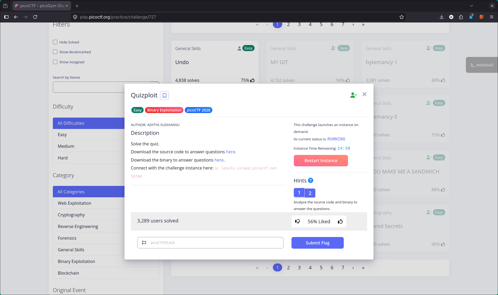
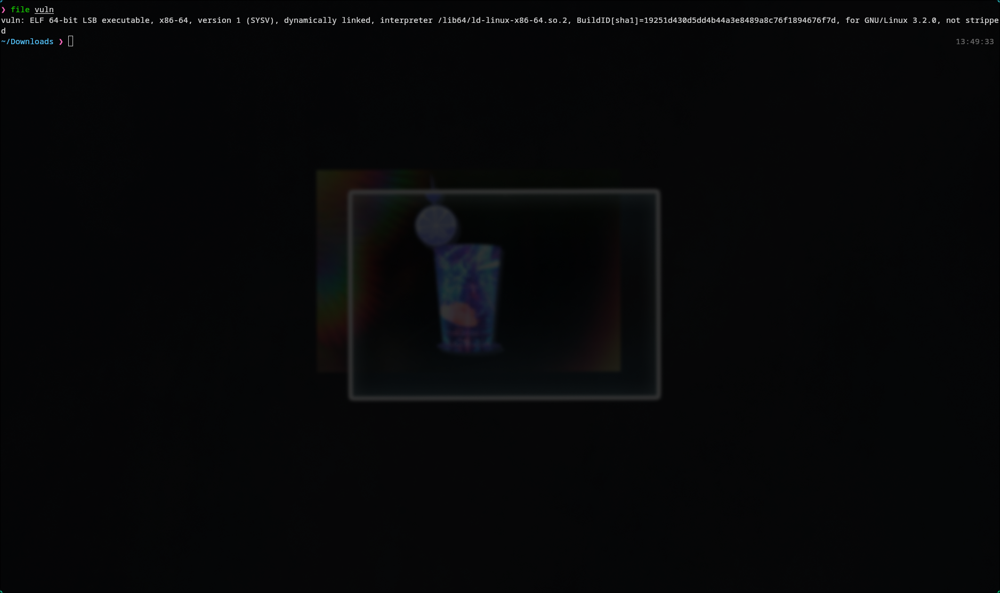
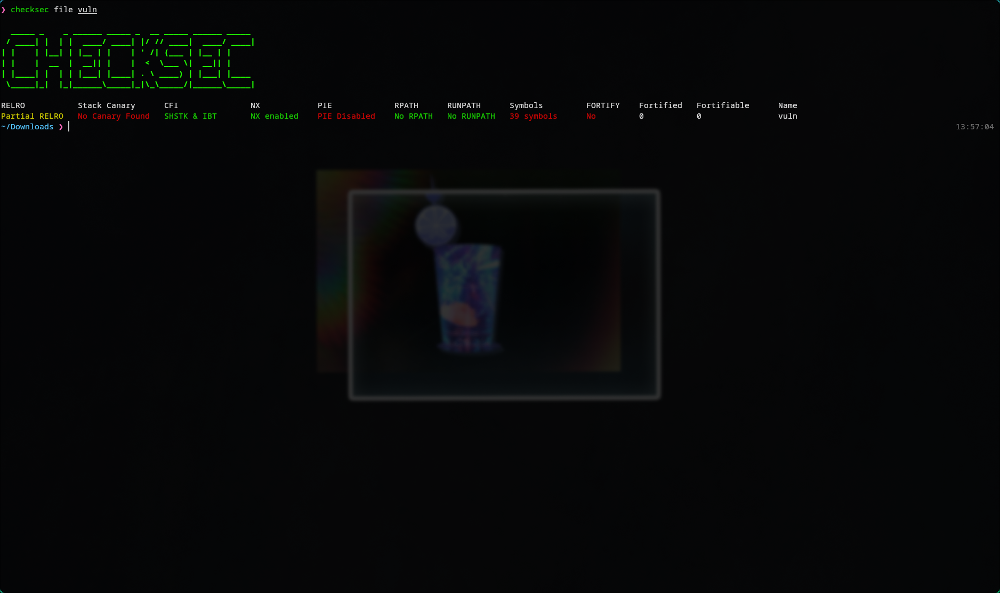
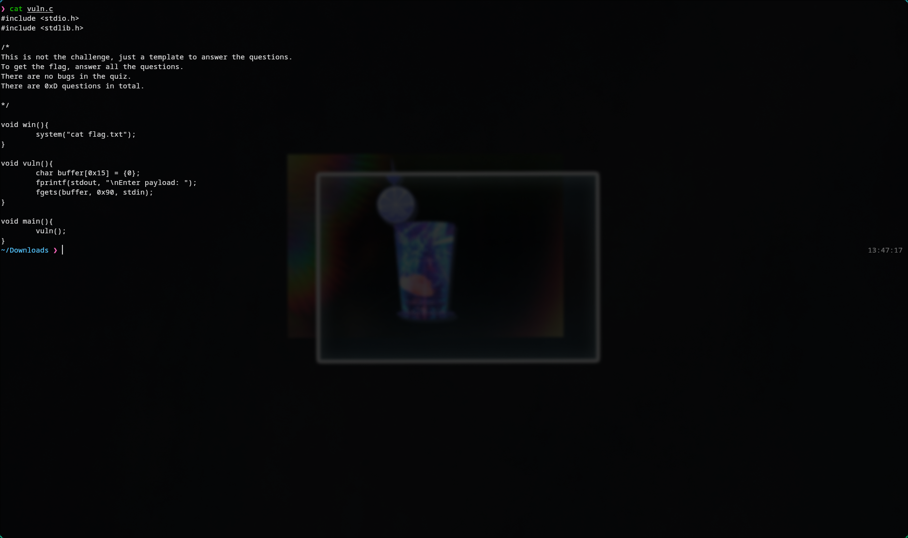
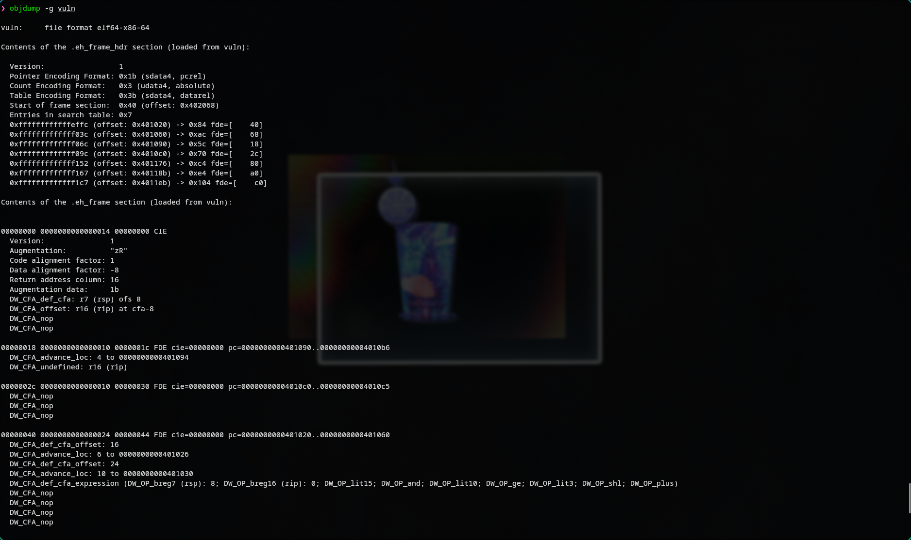
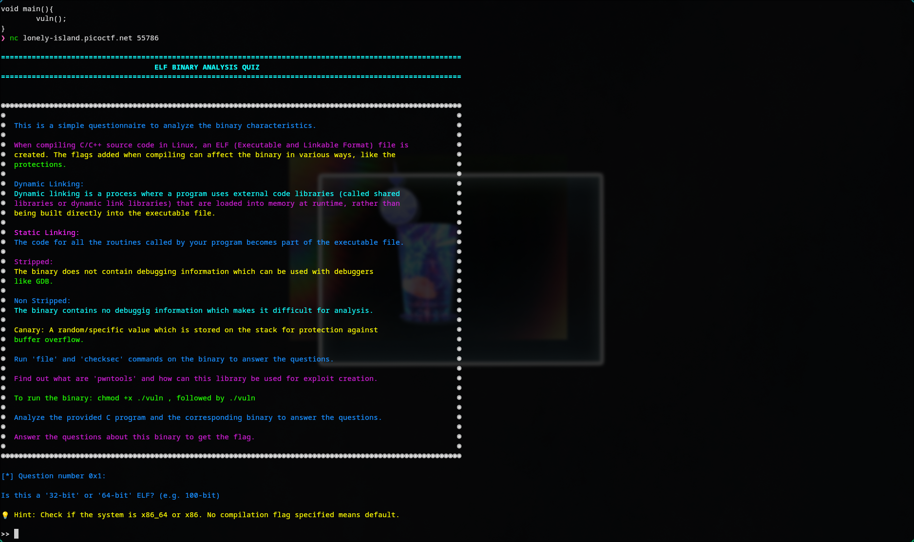
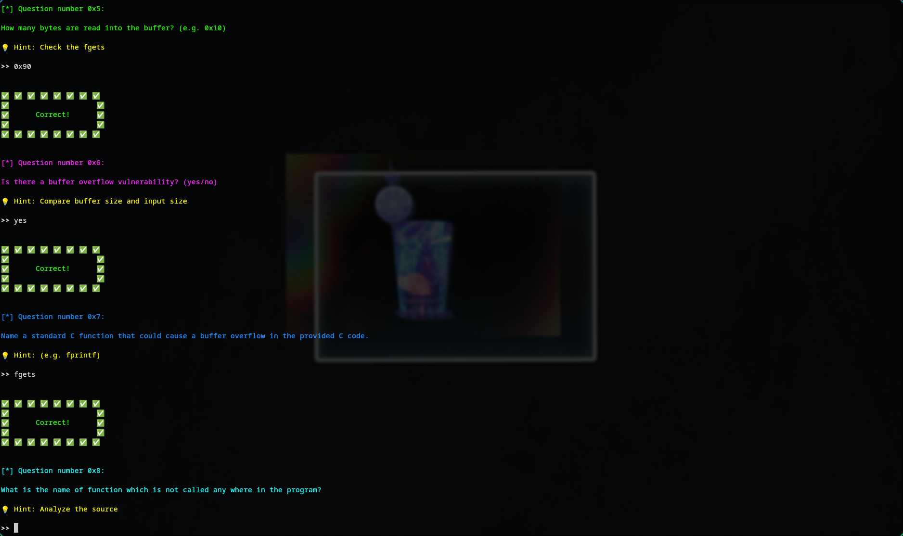
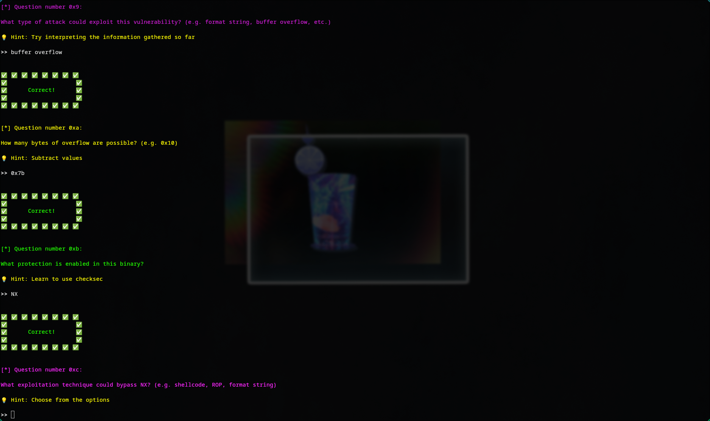
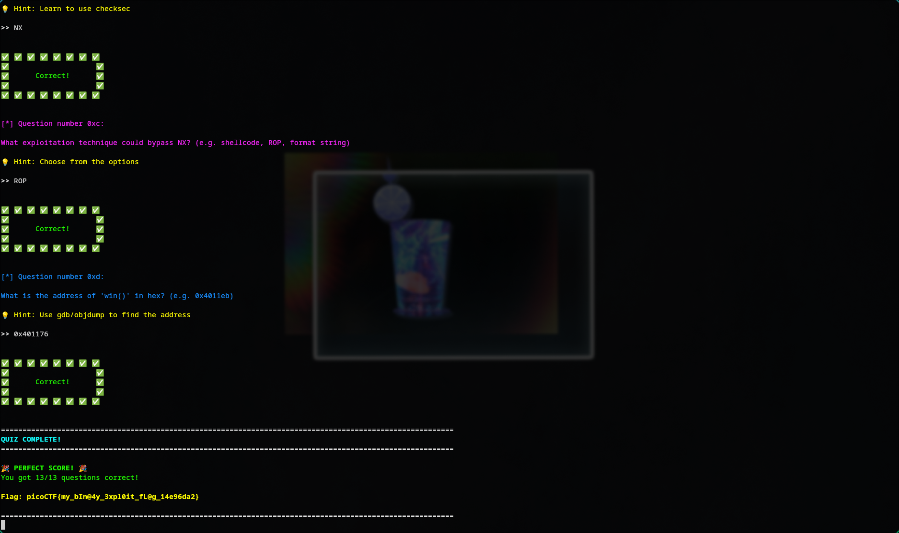

# 🔥 Challenge: Quizploit

**Category:** Binary Exploitation  
**Difficulty:** Easy  
**Points:** 50

---

## 🧩 Description

This challenge presents a quiz about a provided ELF binary and its corresponding C source code. The goal is to analyze the binary using standard Linux tools and answer all questions correctly to receive the flag.



---

## 🧠 Approach

Unlike a typical binary exploitation challenge, this one does not require building and sending a working exploit payload. Instead, the challenge tests understanding of ELF binaries, compiler protections, and common vulnerability concepts.

The provided tools and files made it possible to answer the quiz by inspecting:

- the binary type with `file`
- enabled protections with `checksec`
- function layout and addresses with `objdump`
- the vulnerable logic directly from the source code

From the source code, it was clear that the binary contains a classic stack buffer overflow pattern:

```c
char buffer[0x15] = {0};
fgets(buffer, 0x90, stdin);
```

This shows that a 21-byte buffer is given up to 144 bytes of input, creating an overflow condition.

---

## ⚔️ Analysis

1. Inspect the binary format

```bash
file vuln
```

This shows the binary is:
- 64-bit
- dynamically linked
- not stripped



2. Check binary protections

```bash
checksec file vuln
```

This reveals:
- NX enabled
- No canary found
- PIE disabled
- Partial RELRO



3. Review the source code

```bash
cat vuln.c
```

Important observations:
- `buffer[0x15]` creates a 21-byte buffer
- `fgets(buffer, 0x90, stdin)` reads 144 bytes
- this allows a buffer overflow
- there is an unused `win()` function

  


4. Find the address of `win()`

```bash
objdump -g vuln
```
From the functino layout, the address of `win()` is:
```bash
0x401176
```



5. Answer the quiz questions

Connect using:
```bash
nc lonely-island.picoctf.net 52185
```

Then answer the quiz questions:
1. `64-bit`
2. `dynamic`
3. `not stripped`
4. `0x15`
5. `0x90`
6. `yes`
7. `fgets`
8. `win()`
9. `buffer overflow`
10. `0x7b`
11. `NX`
12. `ROP`
13. `0x401176`

# Some Questions:




---

## 🚩 Flag

Answering all the quiz questions correctly gives us the flag: picoCTF{my_b1n04y_3xpl0it_fl0g_14e96da2}


