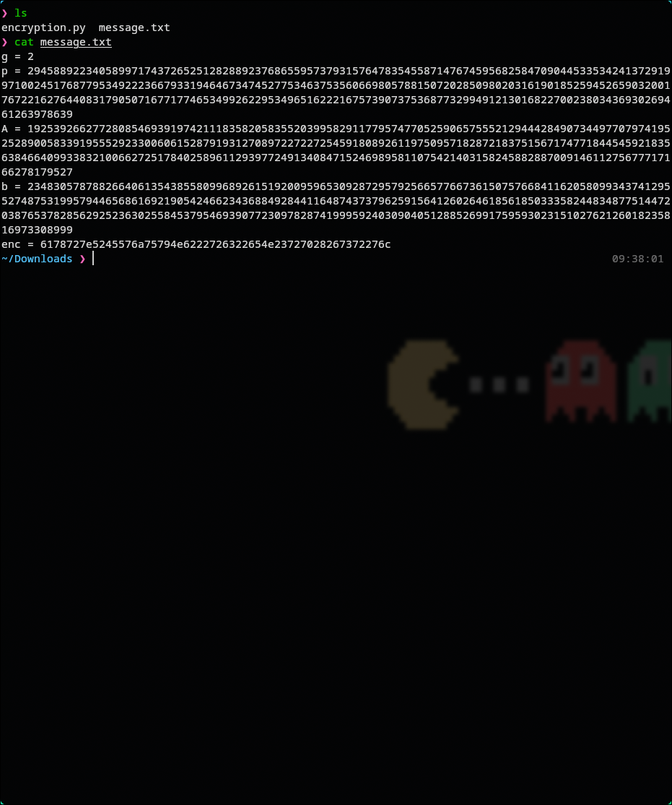
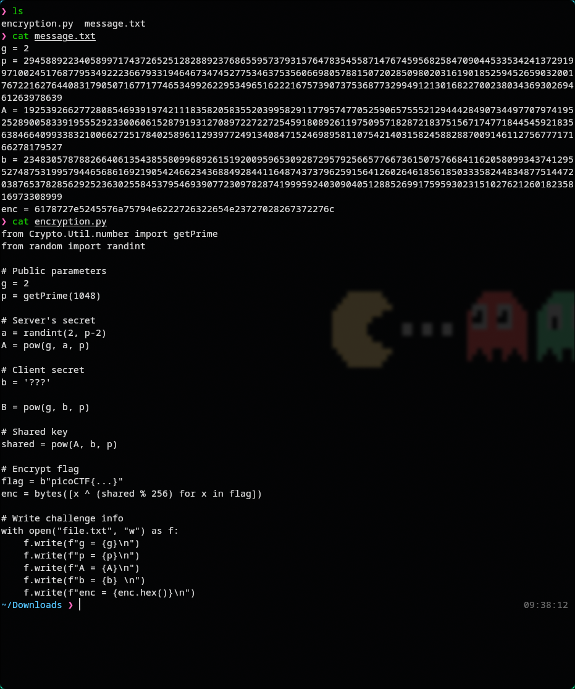
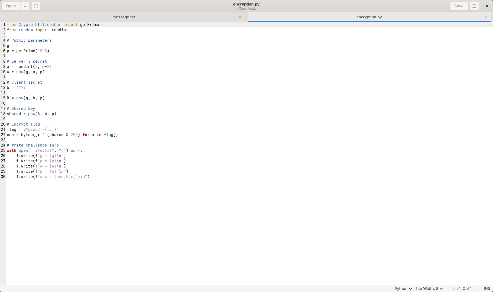
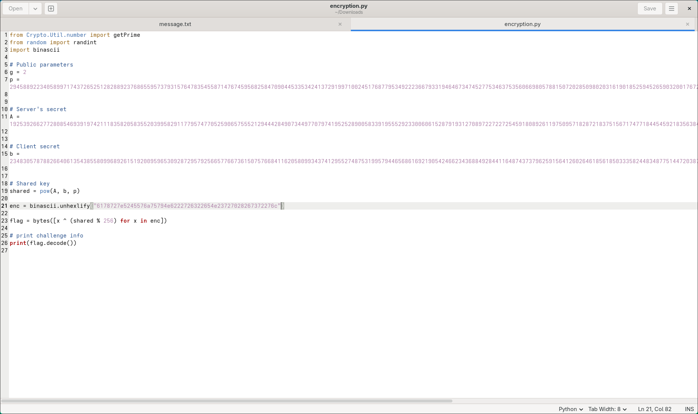
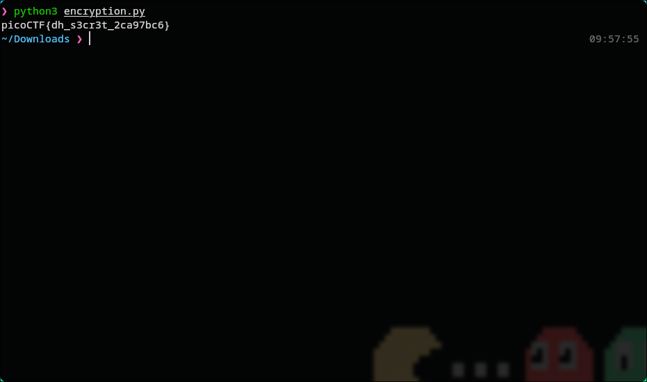

# 🔥 Challenge: Shared Secrets

**Category:** Cryptography  
**Difficulty:**  Easy  
**Points:** 50  

---

## 🧩 Description

The challenge provides us with two file `message.txt` and `encryption.py`. We can see from the output of the two that it is an asymmetric encryption method. However, we are provided with the private key.


---

## 🧠 Approach

We are provided with the code that encrypts a placeholder flag,
however it uses placeholder variables. For this challenge replacing the placeholders with the genuine keys, and swapping the flag and encrypted texts function and using the provided encrypted text will return the flag when run.

---

## ⚔️ Exploitation

1. Show Provided Files
```bash
cd Downloads/
ls
```


2. Show Content
```bash
cat message.txt
cat encryption.py
```



3. Edit `encryption.py`
```bash
gedit encryption.py
```



4. Run `encryption.py`
```bash
python3 encryption.py
```


---
## 🚩 Flag

This gives us the flag: picoCTF{dh_s3cr3t_2ca97bc6}
