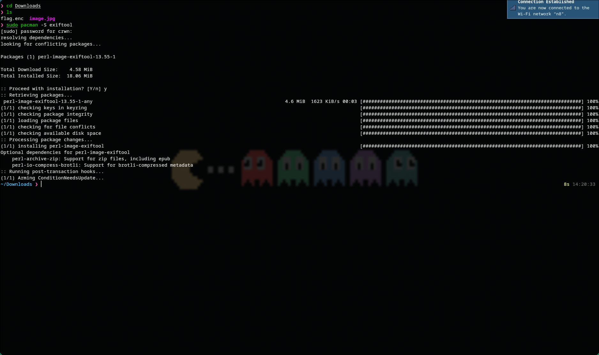
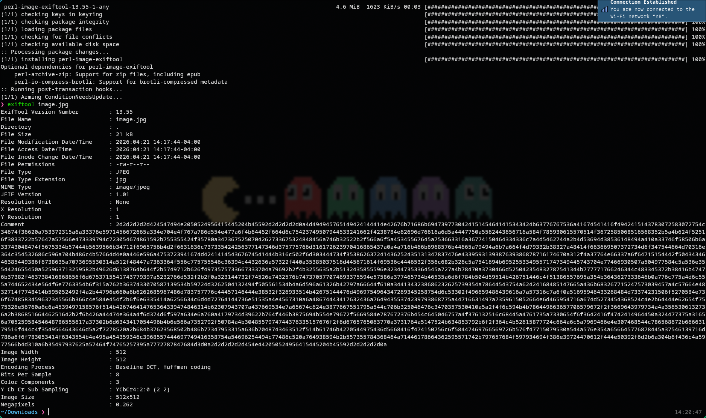
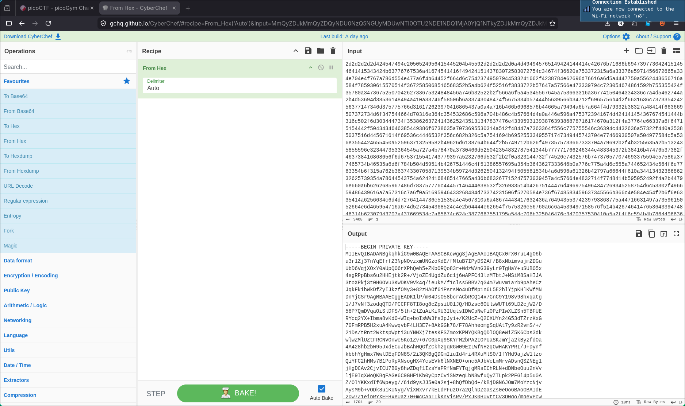
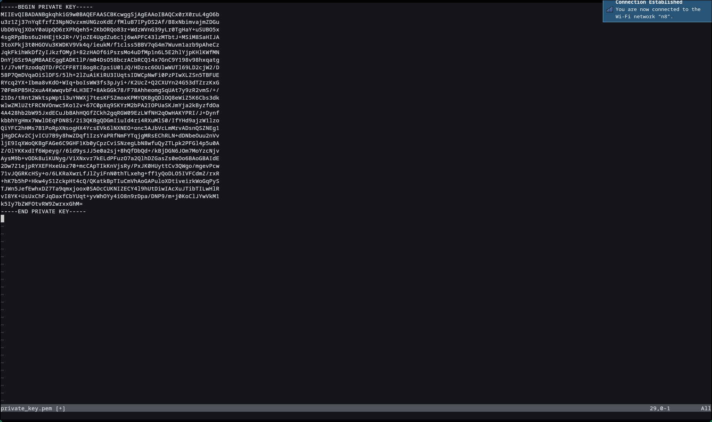

# 🔥 Challenge: Challenge Name

**Category:** Cryptography
**Difficulty:** Easy
**Points:** 50

---

## 🧩 Description
We are provided with a `flag.enc` file and a `image.jpg` file the challenge hints at RSA key needed for decryption being
in the metadata of the image file.


---

## 🧠 Approach
This challenge began by only providing two files.
This challenge will require three tools exiftool for looking at metadata, cyberchef for translating the hex comment on the metadata,
and openssl for decrypting the encrypted flag.
By using these tools we are able to go through metadata analysis and decryption to uncover the flag.

---

## ⚔️ Exploitation

1. Inspection
```bash
cd Downloads
ls
```

The files provide no outward clues, but the challenge mentioned metadata
2. Install ExifTool

3. Inspect metadata
```bash
exiftool image.jpg
```
We can see in the comment section of the metadata what looks like a large chunk of hex

4. Decode hex
We bring the comment metadata into cyberchef to see what it looks like in plaintext
In cyberchef we use the `from hex` recipe

5. Create private_key.pem file
We will need that key for decryption so we copy the private key text into `private_key.pem`

6. Decryption
```bash
openssl pkeyutl -decrypt -inkey private_key.pem -in flag.enc -out flag.txt
cat flag.txt
```
Running this decrypts the `flag.enc` file using the private key we found and returns `flag.txt`


---
## 🚩 Flag

This gives us the flag: picoCTF{rs4_k3y_1n_1mg_3a1b0454}
